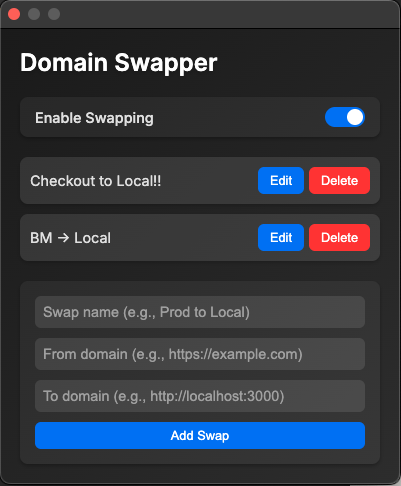

# Domain Swapper Chrome Extension

A modern and sleek Chrome extension that allows you to automatically swap predefined domains with custom targets. Perfect for developers who need to redirect from production or staging environments to local development servers with ease. Features a toggle to enable/disable swapping, a user-friendly interface to manage swaps, and the ability to name swaps for better organization.

## Features
- Automatically swaps domains when landing on a registered "from" domain.
- Toggle to enable or disable swapping.
- Toggle each swap individually.
- Add, edit, and delete domain swaps with custom names.
- Persistent storage of swaps and toggle state.

## Installation

1. **Clone or Download the Repository**:
   - Download the files or clone this repository to your local machine.

2. **Load the Extension in Chrome**:
   - Open Google Chrome.
   - Go to `chrome://extensions/`.
   - Enable "Developer mode" (toggle in the top right).
   - Click "Load unpacked" and select the folder containing the extension files (`manifest.json`, `popup.html`, `popup.css`, `popup.js`, `background.js`, and icon PNGs).

## Usage

1. **Open the Popup**:
   - Click the extension icon in your Chrome toolbar to open the Domain Swapper popup.

2. **Manage the Toggle**:
   - Use the "Enable Swapping" toggle to turn swapping on or off. When off, no domain swaps will occur.

3. **Add a New Swap**:
   - Enter a "Swap name" (e.g., "Checkout to Local!!").
   - Enter the "From domain" (e.g., `https://example.com`).
   - Enter the "To domain" (e.g., `http://localhost:3000`).
   - Check "Exact match?" if you want to match the full URL (default is to determine inclusion).
   - Click "Add Swap" to save. The name will appear in the list.

4. **Edit or Delete Swaps**:
   - Click "Edit" to modify a swap (updates all fields).
   - Click "Delete" to remove a swap.

5. **Automatic Swapping**:
   - When enabled, navigating to a "from" domain will automatically redirect to the corresponding "to" domain.
